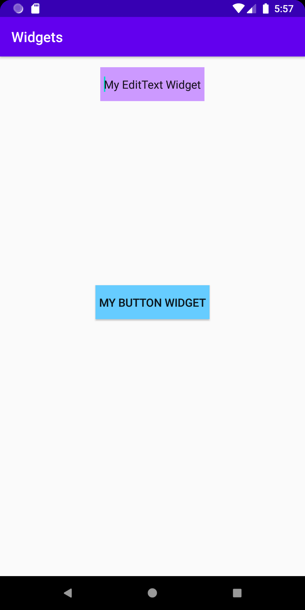
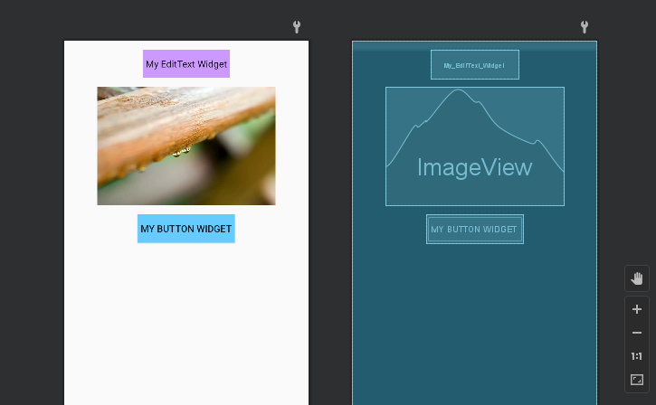
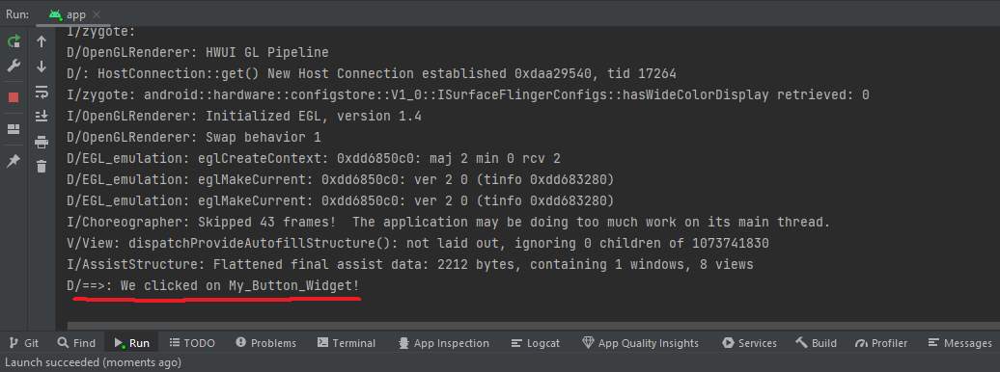

Programmering av mobila applikationer - Rapport "Layouts & Views"


Jag börjar med att ändra appens defualt ConstraintLayout till LinearLayout då det är den typen av layout som jag vill ha för denna inlämning. 
Ändring eller tillägg av layout sker i App -> Resources -> Layout -> Activity_main.xml. För height och width på layouten sätts värdet till "match_parent" 
och värdet för orientation sätts till "vertikal".
Här passar jag även på att ta bort den TextView som redan ligger i layouten. 

```
<?xml version="1.0" encoding="utf-8"?>
<LinearLayout xmlns:android="http://schemas.android.com/apk/res/android"
    xmlns:app="http://schemas.android.com/apk/res-auto"
    xmlns:tools="http://schemas.android.com/tools"
    android:layout_width="match_parent"
    android:layout_height="match_parent"
    android:orientation="vertical"
    tools:context=".MainActivity">
    
    ...
    
</LinearLayout>

```
OBS eftersom många attribut och värden är återkommande för dessa tre widgets så har beskrivningen för koden för alla tre sammanförts i första stycket. Om det är någon kod som är 
specifik endast för ett av objekten så förklaras detta närmare i samband med kodsnutt för objektet/widgeten.

Tillägg av en EditText widget. Först sätter vi ett specifikt ID på vår widget för att vid behov senare kunna referera till vår widget. Detta hanteras genom "android:id"
och värdet sätts till det ID som bestämts för widgeten. Denna princip gäller för att tre widgets som kommer attt presenteras i denna rapport.
För att ändra bredden på denna widget anger jag "android:layout_width" och sätter värdet till "wrap_content". Detta innebär att 
widgeten/objektet enbart kommer att ta upp såpass mycket plats som den behöver, till skillnad från "match_parent" som tar upp lika stor bredd som föräldern gör.
För höjden av objektet anges "android:layout_height" och värdet sätts även här till "wrap_content", här gäller samma princip som ovan nämnt. För alla tre widgets
som följer kommer alla tre att ha samma värde för höjd och bredd, d.v.s. "wrap_content". 
Genom att lägga margin mellan objekten kan jag sälerställa ett mellanrum mellan objekten. För detta använder jag "android:layout_margin" och sätter värdet till "15dp"
(density independent pixel). Detta innebär att runtom hela objektet komemr det att finnas en marginal på 15dp. Alla tre objekt kommer att ha samma värde för marginal.
Jag vill också centrera den text som står innanför min widget, ge den lite luft mellan text och yttervägg. Detta hanteras genom "android:padding" med ett bärde satt till
"5dp". Denna padding gäller för EditText widget och Button widget. 
För att vi enkelt (och just för detta tillfälle) ska se skillnad på våra objekt, hanteras bakgrundsfärgen genom "android:background". Här sätts värdet i hexfärgkod.
EditText får en lila färg medans vår Button får en blå färg.
Det alltid fördelaktigt för utvecklaren att kunna erbjuda anpassning av textstorlek för exemeplvis användare med nedsatt syn. Detta löses genom "android:textSize".
Det värde som sedan anges är den storlek på text som texten kommer att visas i från start. Genom att ange "sp" (scalable pixels) istället för "dp" innebär att anändaren
kan skala upp eller ned texten till en tillfredställande storlek. Här har jag sätt värdet för detta attribut till "16sp". Detta gäller även för Button widget.
"Android:inputType="text"" innebär att textfältet för EditText widget förväntar sig en viss typ av inmatning. Här har vi specificerat att den typ av inmatning som kommer att
ske är vanlig text och därför ska appen då återge/visa en lämplig inmatningsmetod. I detta fall ett tangentbord som användaren kan använda till att mata den text som ska stå i 
EditText widget.


```

<EditText
    android:id="@+id/My_EditText_Widget"
    android:layout_width="wrap_content"
    android:layout_height="wrap_content"
    android:layout_margin="15dp"
    android:padding="5dp"
    android:background="#cc99ff"
    android:minHeight="48dp"
    android:text="@string/my_edittext_widget"
    android:textSize="16sp"
    android:inputType="text" />

```

För en ImageView som för en bild är höjd och bred extremt viktigt. För att få rätt proportioner på bilden är aspect ration viktigt. Eftersom exempelbilden jag
valt att använda är längre i bredd än den är i höjd har jag valt att sätta värdet för width till 300dp och värdet för height till 200 dp, för att behålla rätt
aspect ratio.
Jag önskar att placera min bild i mitten av av layouten (sett ur ett horisontellt perspektiv). För detta används "android:layout_gravity" med värdet satt 
till "center" vilket kommer att placera bilden i mitten av layouten.

OBS jag kan se min bild i designläge men inte i emulator. Jag är osäker på vad detta beror på. Kan det vara så att p.g.a. att jag använder en exempelbild så
syns inte denna i emulatorn?

```

<ImageView
        android:id="@+id/My_imageView_Widget"
        android:layout_width="wrap_content"
        android:layout_height="wrap_content"
        android:layout_margin="15dp"
        android:layout_width="300dp"
        android:layout_height="200dp"
        android:layout_gravity="center"
        android:contentDescription="@string/image"
        tools:srcCompat="@tools:sample/avatars" />
        tools:srcCompat="@tools:sample/backgrounds/scenic" />

```

All information angående kod för Button har gåtts igenom ovan (se EditText widget).

```

<Button
     android:id="@+id/My_Button_Widget"
     android:layout_width="wrap_content"
     android:layout_height="wrap_content"
     android:layout_margin="15dp"
     android:background="#66ccff"
     android:minWidth="48dp"
     android:padding="5dp"
     android:text="@string/my_button_widget"
     android:textSize="16sp" />

```

Ingen av de widget som lagts till bör ha hårdkodade värden för den text som står objeketet eller beskriver objektet. Därför har jag för alla tre objekt lagt
en idividuell sträng beträffande "name". Detta är alltså inte att förväxla med ID. Denna sträng gäller enbart den text som står i objektet eller beskriver objektet
som visas.

```

<resources>
    <string name="app_name">Widgets</string>
    <string name="my_edittext_widget">My EditText Widget</string>
    <string name="image">Image</string>
    <string name="my_button_widget">My Button Widget</string>
</resources>

```

För att vår Button Widget ska fungera behöver vi importera ett par klasser. "Import" innebär att vi vill importera något. "Android.widget" indikerar att
det är en typ av widgetklass vi vill importera. "Button" innebär att det är klassen "Button" vi vill importera. Samma princip gäller för "View" och "Log".

Vår knapp kommer att behöva ett par spcifikationer för att fungera. Först måste vi komma åt vår knapp, referera till vår knapp. Detta gör genom "findViewById" metoden.
"Button b = findViewById(R.id.My_Button_Widget)". Inom parentesen anger vi det ID vi satt på vår knapp, "My_Button_Widget". Nu är knappen refererad till, vi har kopplat till knappen. 

En clicklistener lyssnar efter klick och bestämmer sedan vad som ska ske när ett klick uppfattas. "b.setOnClickListener(new View.OnClickListener()" Här fäster vi en ClickListener till
vår knapp "b". Om ett klick uppfattas för vår knapp "b" kommer LogCat att logga att vi har klickat på knappen "My_Button_Widget". Eftersom vi inte har kopplat någon funktion om vad exakt 
som ska hända när vi klickar på "My_Button_Widget" så kommer inget (förutom LogCat) att reagera när vi klickar på knappen.

```
... 

import android.widget.Button;
import android.view.View;
import android.util.Log;

...

        Button b = findViewById(R.id.My_Button_Widget);

        b.setOnClickListener(new View.OnClickListener() {
            @Override
            public void onClick(View view) {
                Log.d("==>","We clicked on My_Button_Widget!");
            }
        });
...       

```


Emulatorn.


ImageView syns i designläge men inte i emulator.


LogCat tar emot indiktation på att My_Button_Widget har klickats på.


